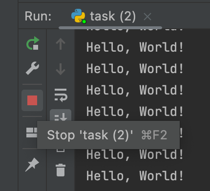

## Fix infinite execution

In the code editor, there is a `while` loop defined inside a [function](course://Functions/Definition). Please do not worry about it at the moment,
you will learn about functions in the next section. The way it is written at the moment, the while loop inside this function 
would run indefinitely
because the condition would always be `True`. You can see it for yourself by running the code. To terminate execution,
use the red stop button on the left side of the Run window.

### Task
Correct the code so that
the loop terminates after printing `"Hello, World!"` 5 times.

 

Update the value of `i` on each iteration.

