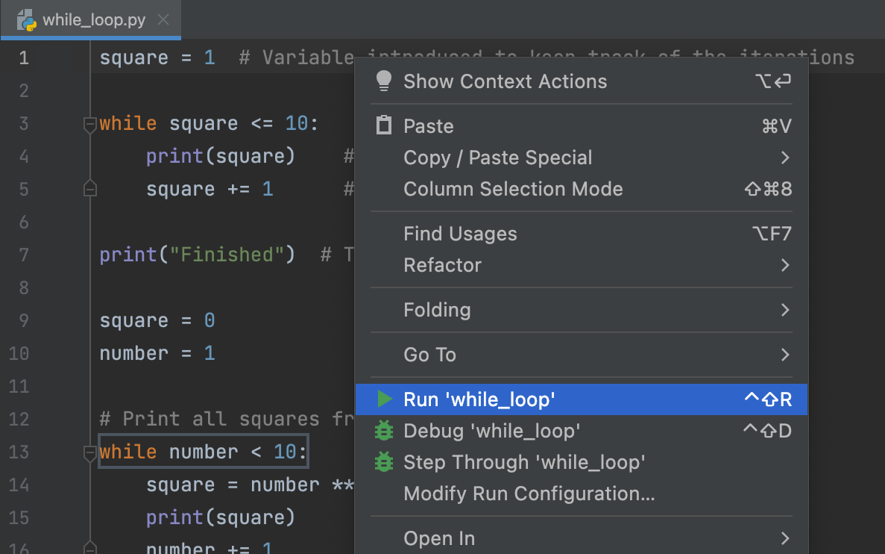

## This demo

This is a demo of **Introduction to Python** tutorial available at JetBrains Academy.
<div class='hint' title="Running the code">
To run your code at any time, choose the Run option from the context menu or press <span style="color: #509DD6">&shortcut:Run;</span>:

<style>
img {
  display: block;
  margin-left: auto;
  margin-right: auto;
}
</style>

</div>

Good luck and have fun!

## Printing a String
Variables are used to store values so we can refer to them later. A variable
is like a label, and in Python we use the ' `=` ' symbol, known as the
assignment operator, to assign a value to a variable.
```python
word = "Anything that comes to mind"
```
Strings in python are surrounded by either single quotation marks, or double quotation marks.
The strings below are the same:
```python
 'hello'
```
```python
 "hello"
 ```

### Task
Assign your name to the variable ```name```.

<div class='hint' >
Change the text JetBrains to your name by typing it into the highlighted placeholder.</div>